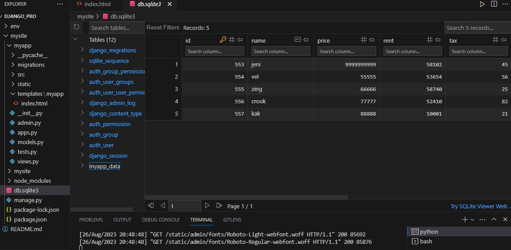

<h1 align="center"> Data_analysis_and_visualization_Django_web_App</h1>

<h2>Technologies used:</h2>

1. Python : Programming Language

2. Django : For web based app.

3. Pandas: For data analysis.

4. ChartJS: For data visualisation.

<h2> Project description: </h2>

>> In this section we will be building a data analytics and visualisation web app. This app will read data from a raw CSV file in a pre-defined format and will generate visualisation charts for us.
>> In this project, I learn about how to make our Django app read a CSV file submitted by the user and then read data from it. &  learn how to convert the CSV data into a pandas data frame so that the data could be manipulated and analysed.
>>  then render out this data to a HTML page and display it in a tabular format. Also analyse the data using pandas and then feed the analysed data to a Django template and display it in terms of charts for data visualisation.
>> Make use of a library called as ChartJS to display data on our webpage. Hence in this project we learn how multiple technologies like Django, Pandas, ChartJS integrates together to form a working web app.
 
&ensp;
<h2>ScreenShot Of Web App</h2>

</img>
</img>
</img>
 

&ensp;
&ensp;
&ensp;
&ensp;
&ensp;
&ensp;

<h3>Django Admin panel and database sqlite</h3>
&ensp;
&ensp;
&ensp;
&ensp;
&ensp;
&ensp;
</img>
 
</img>

</img>
